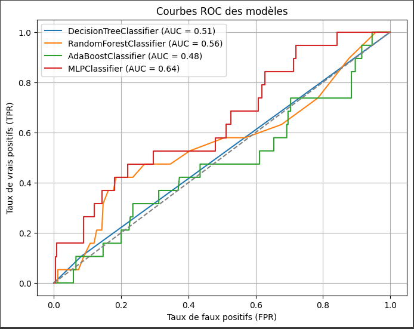
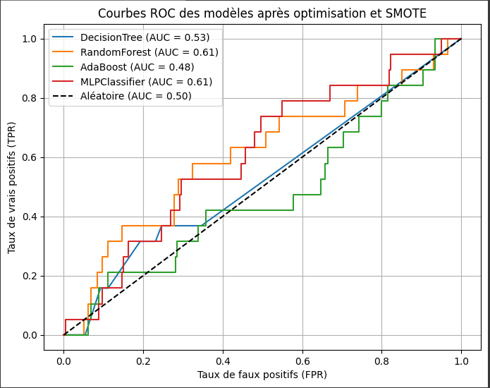
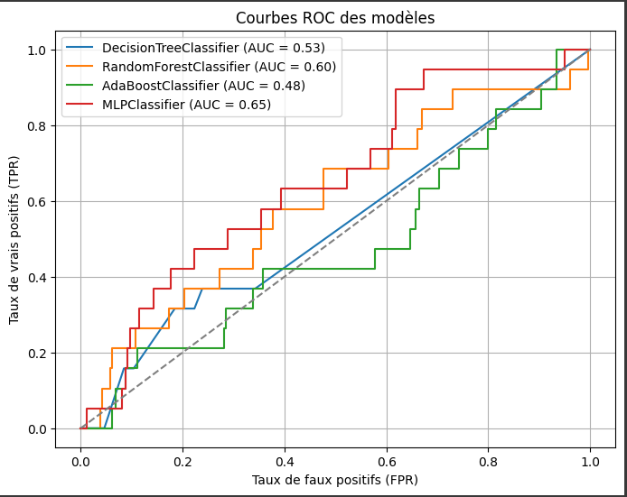
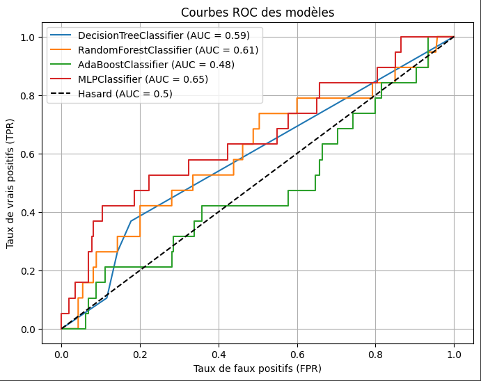

# Travaux pratiques N° 1 : *Machine Learning pour le contrôle de qualité*
par Gilbert HABA et Joseph OGODJA

## Objectif
L’objectif de ce TP est de développer un modèle de classification pour le contrôle qualité des puces
semi-conductrices.

## Description des données (dataset)
Soit le dataset “SECOM-Detecting-Defected-Items”. Le dataset SECOM-Detecting-DefectedItems vise à détecter les puces semi-conductrices défectueuses durant le processus de fabrication.
Il s’agit d’un problème de classification binaire où l’objectif est de prédire si une puce est
défectueuse ou non en considérant. Le dataset contient 590 attributs représentants les mesures de
différents capteurs durant le processus de fabrication

## Démarche de résolution
### I. Pré-traitement des données
1. Vérification du type de données contenues dans le dataset
2. Suppression de colonnes avec plus de 5% de données manquantes (**52 colonnes**)
3. Suppression de lignes avec au moins une données manquante (**11% du dataset**)
4. Suppression de tout les doublons (**0% du dataset**)
5. Suppression de colonnes avec que des valeurs  nulles ou que des valeurs identiques (**116 colonnes**)
6. Suppression de la colonne 'Time' (**1 colonne**)
7. Encodage de la colonne 'Phase'
8. Retrait des colonnes avec des corrélation > 0.9 (**287 colonnes**)
9. Retrait des colonnes avec des corrélation > 0.8. (**NB: Aucun changement observé sur la dimensionnalité du dataset**)
10. Suppression des colonnes avec des colonnes avec des valeurs absolues (valeurs aberrantes) au delà de 5000 (**4 colonnes**)
11. Suppression des colonnes avec des colonnes avec des valeurs absolues (valeurs aberrantes) au delà de 1250 (**7 colonnes**) 
12. Création des vecteur X et Y
13. Affichage des la taille des vecteurs: 
* **Taille de X : (1393, 125)**
* **Taille de Y : (1393,)**

**Total des colonnes supprimées : 467 colonnes**

### Analyse des composantes principales
1. Standardisation des données
2. Application de l'ACP
3. Evaluation des variances cumulées et expliquées
4. Détermination du nombre de composants permettant de conserver une variance expliquée de 95 % : **n = 95**
5. Application de l'ACP avec le nombre trouvé.
6. Division des données en données train et données test.
7. Test des modèles
8. Optimisation des modèles
9. Exportation des meilleurs modèles

## Performances brutes des modèles

| **Modèle**             | **Accuracy** | **Précision** | **Rappel** | **Score F1** | **Matrice de confusion** | **Score en validation croisée** |
|:-----------------------|:-------------|:---------------|:------------|:--------------|:--------------------------|:---------------------------------|
| **DecisionTreeClassifier**  | 0.89         | 0.18           | 0.16        | 0.17           | `[[246, 14], [16, 3]]`    | 0.87                            |
| **RandomForestClassifier**  | 0.93         | 0.00           | 0.00        | 0.00           | `[[259, 1], [19, 0]]`      | 0.93                            |
| **AdaBoostClassifier**      | 0.92         | 0.00           | 0.00        | 0.00           | `[[256, 4], [19, 0]]`      | 0.92                            |
| **MLPClassifier**           | 0.92         | 0.00           | 0.00        | 0.00           | `[[258, 2], [19, 0]]`      | 0.92                            |

---

## Performances après optimization avec SMOTE

| Modèle                | Accuracy | Précision | Rappel | Score F1 | Matrice de confusion | Score en validation croisée |
|-----------------------|-----------|------------|--------|-----------|------------------------|----------------------------|
| **DecisionTreeClassifier** | 0.75      | 0.10       | 0.32   | 0.15      | [[204, 56], [13, 6]]      | 0.83                       |
| **RandomForestClassifier**  | 0.89      | 0.00       | 0.00   | 0.00      | [[248, 12], [19, 0]]       | 0.97                       |
| **AdaBoostClassifier**      | 0.78      | 0.08       | 0.21   | 0.11      | [[213, 47], [15, 4]]       | 0.86                       |
| **MLPClassifier**           | 0.89      | 0.08       | 0.05   | 0.06      | [[248, 12], [18, 1]]        | 0.97                       |

## Performances après correction du déséquilibre

| Modèle                | Accuracy | Précision | Rappel | Score F1 | Matrice de confusion | Score en validation croisée |
|-----------------------|-----------|------------|--------|-----------|------------------------|----------------------------|
| **DecisionTreeClassifier** | 0.76      | 0.10       | 0.32   | 0.15      | [[206, 54], [13, 6]]       | 0.83                       |
| **RandomForestClassifier**  | 0.91      | 0.00       | 0.00   | 0.00      | [[253, 7], [19, 0]]        | 0.98                       |
| **AdaBoostClassifier**      | 0.78      | 0.08       | 0.21   | 0.11      | [[213, 47], [15, 4]]       | 0.86                       |
| **MLPClassifier**           | 0.90      | 0.09       | 0.05   | 0.07      | [[250, 10], [18, 1]]        | 0.98                       |

## Performances après suréchantillonnage

**Hyperparamètres optimaux :**

*DecisionTreeClassifier* : {'max_depth': 20}

*RandomForestClassifier* : {'max_depth': 20, 'n_estimators': 300}

*AdaBoostClassifier* : {'n_estimators': 200}

*MLPClassifier* : {'alpha': 0.0001, 'hidden_layer_sizes': (50,)}

# Modèle performant : MLPClassifier
Après de nombreux tests le modèle performant est le modèle **MLPClassifier** qui a été utilisé dans l'API `predict`. 

# L'API `predict`
- L'API est accessible à l'adresse : [http://localhost:5000/predict](predict)
- Paramètres : Elle prend en paramètre 125 données qui peuvent être générées par le code python `random_data_generator.py`.
- Envoi automatique de données : Les requêtes POST peuvent être automatiquement envoyées avec le code python `requests_sender.py`.